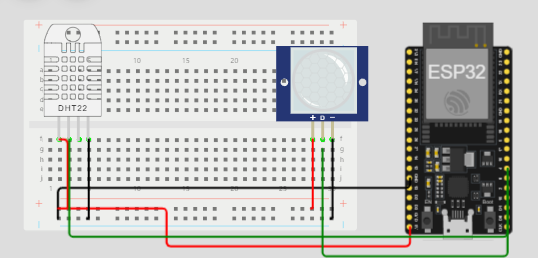
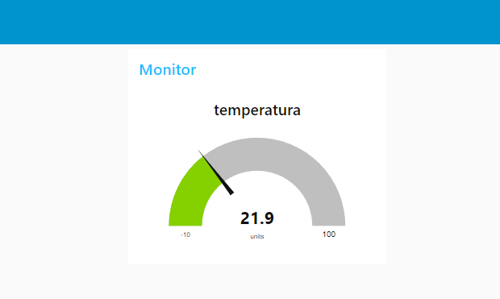
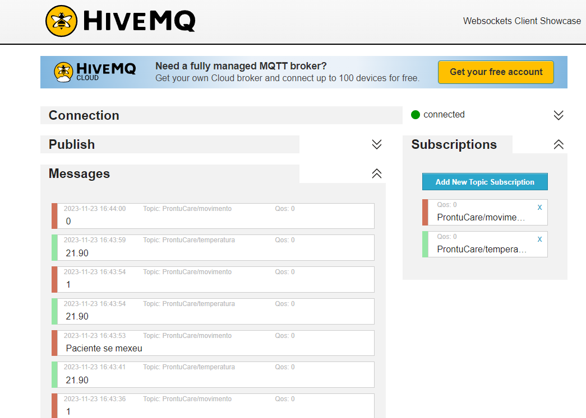
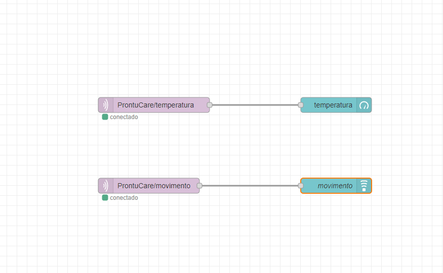

# GLOBAL SOLUTION - 1ESR

## Aluno

- Wesley Souza de Oliveira – **RM 97874**

# ProntuCare: Tecnologia e Saúde
O ProntuCare é um projeto inovador destinado ao monitoramento contínuo de pacientes em estado crítico, especialmente aqueles em coma ou acamados. Desenvolvido para fornecer uma solução abrangente, o sistema utiliza sensores de temperatura (DHT22) e presença (PIR) para coletar dados essenciais sobre o ambiente do paciente. O objetivo principal é possibilitar o acompanhamento não intrusivo, permitindo a detecção precoce de alterações significativas e proporcionando respostas rápidas e eficientes.

## Objetivo

O ProntuCare tem como principal objetivo oferecer uma ferramenta eficaz para profissionais de saúde, cuidadores e familiares, proporcionando monitoramento contínuo e dados valiosos sobre a condição do paciente. A detecção precoce de mudanças no ambiente pode ser crucial para a identificação de problemas de saúde, desconfortos ou eventos críticos, permitindo ação imediata.

## Motivação

A motivação por trás do ProntuCare reside na necessidade de uma solução acessível e abrangente para monitorar pacientes em condições específicas, onde a comunicação direta pode ser limitada. O sistema foi concebido para ser uma ferramenta discreta e eficiente que proporciona tranquilidade aos cuidadores, profissionais de saúde e familiares, ao mesmo tempo em que melhora a qualidade do cuidado prestado.

## Benefícios

1. **Monitoramento Não Intrusivo**: ProntuCare opera discretamente, sem interferir na rotina ou privacidade do paciente.
   
2. **Alertas Imediatos**: A detecção de movimentos é comunicada instantaneamente, permitindo respostas rápidas a situações inesperadas.

3. **Registro de Dados**: O sistema mantém um histórico de temperatura, auxiliando profissionais de saúde na análise de padrões e tendências.

4. **Integração com o Node-RED**: A visualização dos dados por meio do Node-RED Dashboard facilita o acompanhamento remoto e a tomada de decisões informadas.

5. **Ampla Aplicabilidade**: ProntuCare pode ser adaptado para diversas situações clínicas, sendo uma ferramenta versátil para diferentes contextos de cuidados de saúde.

## O projeto faz uso das seguintes tecnologias e componentes:

### Hardware
- **ESP32**: Microcontrolador responsável pela leitura dos sensores e comunicação MQTT.
- **DHT22 (Sensor de Temperatura e Umidade)**: Monitora as condições ambientais do local.
- **PIR (Sensor de Movimento por Infravermelho)**: Detecta movimentos no ambiente.
- **Placa de Prototipagem Wokwi**: Estrutura física do circuito simulado no Wokwi.

## Software

O código-fonte (`sketch.ino`) faz uso das seguintes bibliotecas:

- **DHT Sensor Library**: Para a leitura dos dados do sensor DHT22.
- **PubSubClient**: Para a comunicação MQTT.
- **WiFi**: Para a conexão com a rede sem fio.

## Funcionalidades

O ProntuCare é equipado com diversas funcionalidades projetadas para proporcionar um monitoramento abrangente e eficaz do ambiente do paciente. Abaixo estão as principais funcionalidades:

1. **Monitoramento de Temperatura:** O sensor DHT22 realiza leituras precisas da temperatura do ambiente, permitindo o acompanhamento das condições térmicas ao redor do paciente.

2. **Detecção de Movimentos:** O sensor PIR (Sensor de Movimento por Infravermelho) é empregado para identificar movimentos no ambiente. Isso possibilita a detecção de qualquer atividade ou movimentação por parte do paciente.

3. **Comunicação MQTT:** Os dados de temperatura e movimento são enviados para um servidor MQTT, proporcionando uma forma eficiente de transmitir informações para sistemas externos ou dispositivos de monitoramento remoto.

4. **Lógica de Detecção de Padrões:** O sistema incorpora uma lógica de detecção de padrões que permite identificar situações específicas. Por exemplo, é possível configurar o sistema para alertar quando houver uma movimentação incomum.

5. **Node-RED Dashboard:** A integração com o Node-RED Dashboard facilita a visualização dos dados de temperatura em um gráfico, fornecendo uma representação visual das variações térmicas ao longo do tempo.

6. **Alertas Sonoros:** Quando movimentos são detectados, o sistema emite alertas sonoros, fornecendo uma notificação audível para os cuidadores ou profissionais de saúde. Isso é especialmente útil para situações em que a atenção imediata é necessária.

7. **Ajuste de Parâmetros:** O código-fonte inclui a função `movimento()`, permitindo a personalização da lógica de detecção de movimentos conforme as necessidades específicas do ambiente e do paciente.

8. **Histórico de Dados:** O sistema mantém um registro histórico dos dados de temperatura, possibilitando a análise de padrões e tendências ao longo do tempo.

## Configuração

Para executar e implementar o projeto ProntuCare, siga os passos abaixo:

### 1. Configuração do Hardware:

- Monte o circuito conforme descrito no arquivo `diagram.json` utilizando o simulador Wokwi.
- Certifique-se de conectar corretamente o ESP32, o sensor de temperatura DHT22 e o sensor de presença PIR.

### 2. Instalação de Bibliotecas:

- No ambiente de desenvolvimento Arduino, instale as seguintes bibliotecas:
  - DHT Sensor Library
  - PubSubClient
  - WiFi

### 3. Configuração do Código:

- Abra o arquivo `sketch.ino` na IDE Arduino.
- Modifique as variáveis `ssid` e `password` para corresponder à sua rede Wi-Fi.
- Atualize as variáveis `mqtt_server`, `mqtt_port`, `mqtt_user` e `mqtt_password` com as informações do seu servidor MQTT.

### 4. Ajuste de Parâmetros:

- Caso necessário, ajuste os parâmetros da função `movimento()` no código-fonte para atender às especificidades do ambiente monitorado.

### 5. Fluxo no Node-RED:

- Importe o fluxo do Node-RED a partir do arquivo `flows.json`.
- Certifique-se de que o Node-RED esteja configurado corretamente para receber os dados MQTT.

### 6. Execução e Monitoramento:

- Carregue o código no ESP32 utilizando a IDE Arduino.
- Inicie a execução do código e monitore a saída na porta serial para depuração.
- Abra o Node-RED Dashboard para visualizar os dados em tempo real.
## Vídeo Explicativo

Para um guia visual e mais detalhes sobre o projeto, assista ao vídeo explicativo disponível no [YouTube](https://youtu.be/1bav5v6B6vk).

## Circuito

## DashBoard

## MQTT

## NODE-RED

### *Observação*

*Para mais informações, acesse nosso [github](https://github.com/wesley-souza8/ProntuCare.git)*
